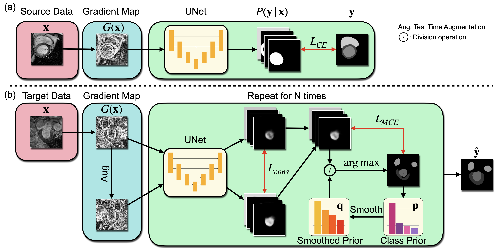

# Gradient-Map-Guided Adaptive Domain Generalization for Cross Modality MRI Segmentation

[](https://www.python.org/)
[](https://pytorch.org/docs/1.4.0/)
[]()

This is the official code repository for
[*Gradient-Map-Guided Adaptive Domain Generalization for Cross Modality MRI Segmentation*]()
by [Bingnan Li](https://cuttle-fish-my.github.io/libingnan.github.io/),
[Zhitong Gao](https://gaozhitong.github.io),
[Xuming He](https://xmhe.bitbucket.io)
([ML4H 2023](https://ml4health.github.io/2023/)).

### Abstract

> Cross-modal MRI segmentation is of great value for computer-aided medical diagnosis, enabling flexible data
> acquisition and model generaliza- tion. However, most existing methods have dif- ficulty in handling local variations
> in
> domain shift and typically require a significant amount of data for training, which hinders their us- age in practice.
> To address these problems, we propose a novel adaptive domain general- ization framework, which integrates a learning-
> free cross-domain representation based on im- age gradient maps and a class prior-informed test-time adaptation
> strategy
> for mitigating lo- cal domain shift. We validate our approach on two multi-modal MRI datasets with six cross- modal
> segmentation tasks. Across all the task settings, our method consistently outperforms competing approaches and shows a
> stable per- formance even with limited training data.

### Pipeline



## Guidelines

### 0. Platform Support

We only guarantee the correctness of the code on the following platforms:

* Linux
* MacOS (with `MPS` acceleration)

### 1. Install dependencies

```bash
pip install -r requirements.txt
```

### 2. Download the dataset

You can download the datasets used in our experiments with instructions in the following links:

- [BraTS 2018](https://www.med.upenn.edu/sbia/brats2018/data.html)
- [MS-CMRSeg 2019](https://zmiclab.github.io/zxh/0/mscmrseg19/)

Once download the datasets, please place the folders into `datasets` with the name of `BraTS2018_Raw`
and `MS-CMRSeg2019_Raw` respectively. The folder structure should be like:

```
BraTS2018_Raw
├── HGG
│   ├── Brats18_2013_10_1
│   ├── Brats18_2013_11_1
│   ├── ...
│   └── Brats18_TCIA08_469_1
└── LGG
    ├── Brats18_2013_0_1
    ├── Brats18_2013_15_1
    ├── ...
    └── Brats18_TCIA13_654_1
```

```
MS-CMRSeg2019_Raw
├── C0LET2_gt_for_challenge19
│   ├── C0_manual_10
│   ├── LGE_manual_35_TestData
│   └── T2_manual_10
└── C0LET2_nii45_for_challenge19
    ├── c0gt
    ├── c0t2lge
    ├── lgegt
    └── t2gt
```

### 3. Preprocess the dataset

#### BraTS2018

```bash
declare -a SOURCE=("t2" "flair")
declare -a TARGET=("t1" "t1ce")
for source in ${SOURCE[@]}
do
  for target in ${TARGET[@]}
  do
    python datasets/BraTS_2018.py \
            --root datasets/BraTS2018_Raw \
            --save_dir datasets/BraTS_2018 \
            --source $source \
            --target $target \
            --train_source True \
            --val_target True
  done
done
```

#### MS-CMRSeg2019

```bash
source="C0"
declare -a TARGET=("T2" "LGE")
for target in ${TARGET[@]}
do
  python datasets/MSCMRSeg2019.py \
          --root datasets/MS-CMRSeg2019_Raw \
          --save_dir datasets/MS-CMRSeg2019 \
          --source $source \
          --target $target \
          --train_source True \
          --val_target True
done
```

### 4. Train the model

```bash
cd scripts
bash train_<source_domain>.sh
```

To visualize the intermediate results, use the following command:

```bash
tensorboard --logdir ./saved_models/<DATASET>/<SOURCE_DOMAIN>/<EXP_NAME>
```

#### Remark:

* Only set `--use_fp16` `True` when using `NVIDIA GPU` or `MPS`.

### 5. Test the model

```bash
cd scripts
bash test_<SETTING>.sh
```

We only provide the test scripts of `C02LGE` and `t22t1`.
You can easily modify the scripts to test any settings in our paper.

#### Remark:

If you want to see the segmentation results and formal evaluation metrics, use the following command:

```bash
tensorboard --logdir ./val_res/<DATASET>/<SETTING>/<EXP_NAME>
```

### Pretrained models

|    Dataset    | Source Domain |                                           Download                                            | Avg_Dice(T2) | Avg_Dice(LGE) | Avg_Dice(t1) | Avg_Dice(t1ce) |  Size  |
|:-------------:|:-------------:|:---------------------------------------------------------------------------------------------:|:------------:|:-------------:|:------------:|:--------------:|:------:|
| MS-CMRSeg2019 |      C0       | [ckpt](https://drive.google.com/file/d/1BlYVIOSf_nXve89G-C8U47wVC8vA-zJF/view?usp=share_link) |    0.8555    |    0.8562     |      -       |       -        | 105.6M |
|   BraTS2018   |      t2       |  [ckpt](https://drive.google.com/file/d/1Z6AvTQmGyA03ehivOpfBHuseFA97q0ov/view?usp=sharing)   |      -       |       -       |    0.6813    |     0.6914     | 105.6M |
|   BraTS2018   |     flair     |  [ckpt](https://drive.google.com/file/d/1rAdST_vNGqXPcoAbI6_XHR2IycP5ZRjM/view?usp=sharing)   |      -       |       -       |    0.4189    |     0.5986     | 105.6M |

### Citation

```angular2html
Coming Soon
```